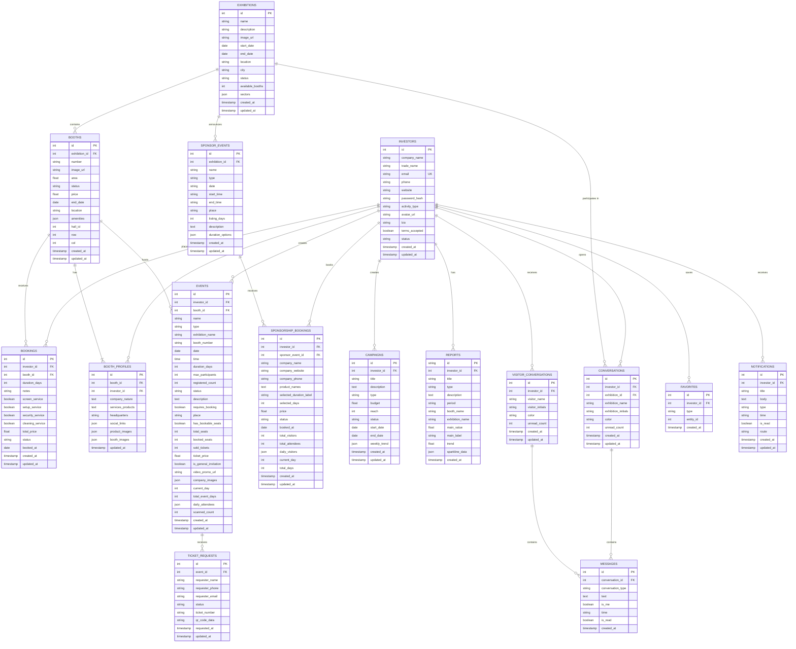

# ExpoCore Investor Platform — Technical Design Document

---

## Part 1 — Class Diagram (Rows, Relationships, Attributes & Operations)

```mermaid
classDiagram

    %% ══════════════════════════════════════════════════
    %%  MODELS (Data Layer)
    %% ══════════════════════════════════════════════════

    class UserModel {
        +int id
        +String name
        +String email
        +String token
        +String companyName
        +String avatarUrl
        +fromJson(Map j)$ UserModel
    }

    class ExhibitionModel {
        +int id
        +String name
        +String description
        +String imageUrl
        +String startDate
        +String endDate
        +String location
        +String city
        +String status
        +int availableBooths
        +List~String~ sectors
        +bool isFavorite
        +fromJson(Map j)$ ExhibitionModel
    }

    class BoothModel {
        +int id
        +String number
        +String exhibitionName
        +String imageUrl
        +double area
        +String status
        +double price
        +String endDate
        +String location
        +List~String~ amenities
        +bool isFavorite
        +fromJson(Map j)$ BoothModel
    }

    class EventModel {
        +int id
        +String name
        +String type
        +String boothNumber
        +String exhibitionName
        +String date
        +String time
        +int maxParticipants
        +int registeredCount
        +String status
        +String description
        +bool requiresBooking
        +bool isFavorite
        +String place
        +int durationDays
        +bool hasBookableSeats
        +int totalSeats
        +int bookedSeats
        +double ticketPrice
        +bool isGeneralInvitation
        +String videoPromoUrl
        +int currentDay
        +int totalEventDays
        +List~int~ dailyAttendees
        +int scannedCount
        +fromJson(Map j)$ EventModel
    }

    class ExhibitionSponsorEvent {
        +int id
        +String name
        +String type
        +int exhibitionId
        +String exhibitionName
        +String exhibitionImageUrl
        +String date
        +String startTime
        +String endTime
        +String place
        +int listingDays
        +String description
        +List~SponsorDurationOption~ durationOptions
        +bool isFavorite
        +fromJson(Map j)$ ExhibitionSponsorEvent
    }

    class SponsorDurationOption {
        +String label
        +int days
        +double price
        +fromJson(Map j)$ SponsorDurationOption
    }

    class SponsorshipBookingModel {
        +int id
        +int eventId
        +String eventName
        +String eventType
        +String exhibitionName
        +String date
        +String place
        +String time
        +String selectedDurationLabel
        +int selectedDays
        +double price
        +String status
        +String bookedAt
        +int totalVisitors
        +int totalAttendees
        +List~int~ dailyVisitors
        +int currentDay
        +int totalDays
        +fromJson(Map j)$ SponsorshipBookingModel
    }

    class TicketRequestModel {
        +int id
        +int eventId
        +String requesterName
        +String requesterPhone
        +String requesterEmail
        +String requestedAt
        +String status
        +String? qrCodeData
        +String? ticketNumber
        +fromJson(Map j)$ TicketRequestModel
    }

    class CampaignModel {
        +int id
        +String title
        +String type
        +String startDate
        +String endDate
        +int reach
        +String status
        +double budget
        +List~double~ weeklyTrend
        +fromJson(Map j)$ CampaignModel
    }

    class ReportModel {
        +String id
        +String title
        +String type
        +String description
        +String period
        +String boothName
        +String exhibitionName
        +String createdAt
        +double mainValue
        +String mainLabel
        +double trend
        +List~double~ sparklineData
        +fromJson(Map j)$ ReportModel
    }

    class NotificationModel {
        +int id
        +String title
        +String body
        +String type
        +String time
        +bool isRead
        +String? route
        +fromJson(Map j)$ NotificationModel
        +copyWith(bool? isRead) NotificationModel
    }

    class ConversationModel {
        +int id
        +int exhibitionId
        +String exhibitionName
        +String exhibitionInitials
        +int color
        +List~MessageModel~ messages
        +int unreadCount
        +String lastMessage
        +String lastTime
        +fromJson(Map j)$ ConversationModel
    }

    class VisitorConversationModel {
        +int id
        +String visitorName
        +String visitorInitials
        +int color
        +List~MessageModel~ messages
        +int unreadCount
        +String lastMessage
        +String lastTime
        +fromJson(Map j)$ VisitorConversationModel
    }

    class MessageModel {
        +int id
        +String text
        +bool isMe
        +String time
        +bool isRead
        +fromJson(Map j)$ MessageModel
        +toJson() Map
    }

    class ExhibitionMapModel {
        +int gridCols
        +int gridRows
        +List~MapHallModel~ halls
        +fromJson(Map j)$ ExhibitionMapModel
    }

    class MapHallModel {
        +int id
        +String name
        +List~MapBoothModel~ booths
    }

    class MapBoothModel {
        +int id
        +String number
        +int row
        +int col
        +bool isBooked
        +double area
        +double price
        +String hallName
        +int hallId
        +List~String~ amenities
    }

    %% ══════════════════════════════════════════════════
    %%  CORE LAYER
    %% ══════════════════════════════════════════════════

    class Crud {
        -Dio _dio
        -Map _authHeader
        -Options _opts
        -Options _uploadOpts
        +getData(String url, Map? params) Map
        +postData(String url, Map data) Map
        +putData(String url, Map data) Map
        +patchData(String url, Map data) Map
        +deleteData(String url) Map
        +uploadData(String url, Map fields, List filePaths) Map
        -_err(DioException e) Map
    }

    class AppLink {
        +server$ String
        +login$ String
        +register$ String
        +logout$ String
        +forgotPassword$ String
        +exhibitions$ String
        +exhibitionDetail(int id)$ String
        +booths$ String
        +bookBooth$ String
        +investorDashboard$ String
        +investorProfile$ String
        +investorBookings$ String
        +bookingDetail(int id)$ String
        +cancelBooking(int id)$ String
        +investorCampaigns$ String
        +campaignDetail(int id)$ String
        +investorEvents$ String
        +eventDetail(int id)$ String
        +eventTicketRequests(int id)$ String
        +ticketRequestAction(int eId, int rId)$ String
        +exhibitionSponsorEvents$ String
        +investorSponsorships$ String
        +investorAnalytics$ String
        +investorMessages$ String
        +conversationDetail(int id)$ String
        +sendMessage(int id)$ String
        +investorVisitorMessages$ String
        +visitorConversationDetail(int id)$ String
        +sendVisitorMessage(int id)$ String
        +investorFavorites$ String
        +favoriteExhibition(int id)$ String
        +favoriteBooth(int id)$ String
        +favoriteEvent(int id)$ String
        +investorReports$ String
        +reportDownload(String id, String fmt)$ String
        +investorNotifications$ String
        +markNotificationRead(int id)$ String
        +markAllNotificationsRead$ String
        +boothProfile(int boothId)$ String
    }

    class Services {
        -SharedPreferences _prefs
        +token String
        +isDarkMode bool
        +lang String
        +onboardDone bool
        +companyName String
        +isLoggedIn bool
        +init() Services
        +saveToken(String token)
        +saveTheme(bool isDark)
        +saveLang(String lang)
        +setOnboardDone()
        +saveCompany(String name)
        +clearSession()
    }

    %% ══════════════════════════════════════════════════
    %%  CONTROLLERS (Business Logic Layer)
    %% ══════════════════════════════════════════════════

    class LoginController {
        -Crud _crud
        +emailCtrl TextEditingController
        +passwordCtrl TextEditingController
        +formKey GlobalKey
        +status Rx~StatusRequest~
        +obscure RxBool
        +rememberMe RxBool
        +toggleObscure()
        +toggleRemember()
        +login()
        -_extract(dynamic data, List keys) dynamic
    }

    class RegisterController {
        -Crud _crud
        +companyCtrl TextEditingController
        +emailCtrl TextEditingController
        +passCtrl TextEditingController
        +status Rx~StatusRequest~
        +termsAccepted RxBool
        +activityType RxString
        +register()
    }

    class DashboardController {
        -Crud _crud
        +companyName RxString
        +selectedPeriod RxString
        +isLoading RxBool
        +totalBookings RxInt
        +activeBooths RxInt
        +publishedEvents RxInt
        +totalEngagement RxInt
        +featuredExhibitions RxList~ExhibitionModel~
        +upcomingEvents RxList~EventModel~
        +changePeriod(String p)
        +refresh()
        -_loadDashboard()
        -_loadFallback()
        +latestExhibitions List~ExhibitionModel~
    }

    class ExhibitionsController {
        -Crud _crud
        +exhibitions RxList~ExhibitionModel~
        +filtered RxList~ExhibitionModel~
        +statusFilter RxString
        +isLoading RxBool
        +applyFilter(String f)
        +onSearch(String q)
        +toggleFavorite(ExhibitionModel e)
        +refresh()
        -_loadExhibitions()
        -_filterList(String? query)
    }

    class BoothController {
        -Crud _crud
        +booths RxList~BoothModel~
        +filtered RxList~BoothModel~
        +statusFilter RxString
        +isLoading RxBool
        +applyFilter(String f)
        +toggleFavorite(BoothModel b)
        +refresh()
        -_loadBooths()
    }

    class BoothMapController {
        +mapData Rx~ExhibitionMapModel~
        +selectedBooth Rx~MapBoothModel~
        +isLoading RxBool
        +allBooths RxList~MapBoothModel~
        +transformationController TransformationController
        +onBoothTapped(MapBoothModel booth, Offset? pos)
        +clearSelection()
        +resetView()
        +proceedToBooking()
        +companyForBooth(MapBoothModel booth) BoothCompanyInfo?
        +loadMapData()
    }

    class BookingController {
        -Crud _crud
        +booth Rx~BoothModel~
        +notesCtrl TextEditingController
        +duration RxInt
        +isSubmitting RxBool
        +status Rx~StatusRequest~
        +screenService RxBool
        +setupService RxBool
        +securitySvc RxBool
        +cleaningService RxBool
        +total double
        +setBooth(BoothModel b)
        +submitBooking()
        +cancelBooking(int bookingId)
    }

    class BoothManagementController {
        -Crud _crud
        +booth BoothModel
        +socialLinks RxList~String~
        +productImages RxList~String~
        +boothImages RxList~String~
        +boothEvents RxList~EventModel~
        +profileLinks List~String~
        +isLoading RxBool
        +isSaving RxBool
        +addSocialLink()
        +removeSocialLink(String link)
        +addProductImage()
        +addBoothImage()
        +saveProfile()
        -_loadBoothProfile()
        -_loadBoothEvents()
    }

    class EventsController {
        -Crud _crud
        +myEvents RxList~EventModel~
        +exhibitionSponsorEvents RxList~ExhibitionSponsorEvent~
        +mySponsorshipBookings RxList~SponsorshipBookingModel~
        +ticketRequests RxMap~int,List~TicketRequestModel~~
        +myBooths RxList~BoothModel~
        +isCreating RxBool
        +isBooking RxBool
        +createEvent()
        +bookSponsorship(ExhibitionSponsorEvent event)
        +getTicketRequests(int eventId) List~TicketRequestModel~
        +approveTicketRequest(TicketRequestModel req)
        +rejectTicketRequest(TicketRequestModel req)
        +pendingRequestsCount(int eventId) int
        +toggleSponsorFavorite(ExhibitionSponsorEvent e)
        +statusLabel(String s) String
        +statusColor(String s) Color
        -_loadAll()
        -_loadMyEvents()
        -_loadSponsorEvents()
        -_loadSponsorships()
        -_loadBooths()
        -_loadTicketRequests(int eventId)
    }

    class CampaignsController {
        -Crud _crud
        +campaigns RxList~CampaignModel~
        +isLoading RxBool
        +isCreating RxBool
        +titleCtrl TextEditingController
        +selectedType RxString
        +createCampaign()
        +deleteCampaign(int id)
        +refresh()
        -_loadCampaigns()
    }

    class AnalyticsController {
        -Crud _crud
        +selectedPeriod RxString
        +isLoading RxBool
        +totalVisits RxInt
        +productViews RxInt
        +eventParticipants RxInt
        +totalEngagement RxInt
        +visitsTrend RxDouble
        +visitorsData RxList~double~
        +engagementData RxList~double~
        +changePeriod(String p)
        +goToReports()
        -_loadAnalytics()
        -_loadFallback()
    }

    class ReportsController {
        -Crud _crud
        +reports RxList~ReportModel~
        +filtered RxList~ReportModel~
        +selectedType RxString
        +isDownloading RxBool
        +downloadProgress RxDouble
        +filterByType(String type)
        +downloadReport(String id, String format)
        +refresh()
        -_loadReports()
    }

    class MessagesController {
        -Crud _crud
        +conversations RxList~ConversationModel~
        +activeConversationId Rx~int~
        +isLoading RxBool
        +isSending RxBool
        +activeConversation ConversationModel?
        +activeMessages List~MessageModel~
        +totalUnread int
        +openConversation(int id)
        +openConversationForExhibitionName(String name)
        +sendMessage()
        +refresh()
        -_loadConversations()
        -_loadConversationMessages(int id)
    }

    class VisitorMessagesController {
        -Crud _crud
        +visitorConversations RxList~VisitorConversationModel~
        +activeConversationId Rx~int~
        +isLoading RxBool
        +isSending RxBool
        +activeConversation VisitorConversationModel?
        +activeMessages List~MessageModel~
        +totalUnread int
        +openConversation(int id)
        +openConversationForVisitor(String name)
        +sendMessage()
        +refresh()
        -_loadConversations()
        -_loadConversationMessages(int id)
    }

    class FavoritesController {
        -Crud _crud
        +favoriteExhibitions RxList~ExhibitionModel~
        +favoriteEvents RxList~ExhibitionSponsorEvent~
        +favoriteBooths RxList~BoothModel~
        +selectedTab RxInt
        +isLoading RxBool
        +isExhibitionFavorited(int id) bool
        +isBoothFavorited(int id) bool
        +isEventFavorited(int id) bool
        +toggleFavoriteExhibition(ExhibitionModel e)
        +toggleFavoriteBooth(BoothModel b)
        +toggleFavoriteEvent(ExhibitionSponsorEvent e)
        +removeExhibition(ExhibitionModel e)
        +removeBooth(BoothModel b)
        +removeEvent(ExhibitionSponsorEvent e)
        +refresh()
        -_loadFavorites()
    }

    class NotificationsController {
        -Crud _crud
        +notifications RxList~NotificationModel~
        +isLoading RxBool
        +unreadCount int
        +markRead(int id)
        +markAllRead()
        +refresh()
        -_loadNotifications()
    }

    class ProfileCompanyController {
        -Crud _crud
        +nameCtrl TextEditingController
        +emailCtrl TextEditingController
        +isEditing RxBool
        +isSaving RxBool
        +status Rx~StatusRequest~
        +toggleEdit()
        +saveChanges()
        +viewReport()
        -_loadProfile()
    }

    class SettingsController {
        -Crud _crud
        +isDark RxBool
        +notificationsEnabled RxBool
        +currentLang RxString
        +isLoggingOut RxBool
        +toggleTheme(bool val)
        +changeLanguage(String lang)
        +logout()
    }

    %% ══════════════════════════════════════════════════
    %%  RELATIONSHIPS
    %% ══════════════════════════════════════════════════

    %% All controllers use Crud for API communication
    LoginController           ..> Crud : uses
    RegisterController        ..> Crud : uses
    DashboardController       ..> Crud : uses
    ExhibitionsController     ..> Crud : uses
    BoothController           ..> Crud : uses
    BookingController         ..> Crud : uses
    BoothManagementController ..> Crud : uses
    EventsController          ..> Crud : uses
    CampaignsController       ..> Crud : uses
    AnalyticsController       ..> Crud : uses
    ReportsController         ..> Crud : uses
    MessagesController        ..> Crud : uses
    VisitorMessagesController ..> Crud : uses
    FavoritesController       ..> Crud : uses
    NotificationsController   ..> Crud : uses
    ProfileCompanyController  ..> Crud : uses
    SettingsController        ..> Crud : uses

    %% Crud reads token from Services
    Crud ..> Services : reads token

    %% Controllers referencing Services
    LoginController           ..> Services : save token
    ProfileCompanyController  ..> Services : save company name
    SettingsController        ..> Services : read/write theme & lang
    DashboardController       ..> Services : read company name

    %% Model compositions
    ExhibitionSponsorEvent    "1" *-- "many" SponsorDurationOption
    ConversationModel         "1" *-- "many" MessageModel
    VisitorConversationModel  "1" *-- "many" MessageModel
    ExhibitionMapModel        "1" *-- "many" MapHallModel
    MapHallModel              "1" *-- "many" MapBoothModel
    TicketRequestModel        ..> EventModel : belongs to
    SponsorshipBookingModel   ..> ExhibitionSponsorEvent : references

    %% Controller → Model relationships
    DashboardController       ..> ExhibitionModel : uses
    DashboardController       ..> EventModel : uses
    ExhibitionsController     ..> ExhibitionModel : uses
    BoothController           ..> BoothModel : uses
    BoothMapController        ..> ExhibitionMapModel : uses
    BoothMapController        ..> MapBoothModel : uses
    BookingController         ..> BoothModel : uses
    BoothManagementController ..> BoothModel : uses
    BoothManagementController ..> EventModel : uses
    EventsController          ..> EventModel : uses
    EventsController          ..> ExhibitionSponsorEvent : uses
    EventsController          ..> SponsorshipBookingModel : uses
    EventsController          ..> TicketRequestModel : uses
    EventsController          ..> BoothModel : uses
    CampaignsController       ..> CampaignModel : uses
    ReportsController         ..> ReportModel : uses
    MessagesController        ..> ConversationModel : uses
    MessagesController        ..> MessageModel : uses
    VisitorMessagesController ..> VisitorConversationModel : uses
    VisitorMessagesController ..> MessageModel : uses
    FavoritesController       ..> ExhibitionModel : uses
    FavoritesController       ..> BoothModel : uses
    FavoritesController       ..> ExhibitionSponsorEvent : uses
    NotificationsController   ..> NotificationModel : uses
    LoginController           ..> UserModel : parses
```

---

## Part 2 — Entity Relationship Diagram (ERD)



---

## Part 3 — Architecture Overview

```
┌─────────────────────────────────────────────────────────────────────────┐
│                          FLUTTER WEB APP                                │
│                                                                         │
│  ┌─────────────────┐   ┌──────────────────────┐   ┌─────────────────┐  │
│  │    VIEW LAYER   │   │  CONTROLLER LAYER    │   │   MODEL LAYER   │  │
│  │  (UI / Widgets) │◄──│  (GetxController)    │──►│  (Data Classes) │  │
│  │                 │   │                      │   │                 │  │
│  │ • 35 Screens    │   │ • 17 Controllers     │   │ • 14 Models     │  │
│  │ • GetBuilder/   │   │ • Rx observables     │   │ • fromJson()    │  │
│  │   Obx widgets   │   │ • Business logic     │   │ • toJson()      │  │
│  └─────────────────┘   └──────────┬───────────┘   └─────────────────┘  │
│                                   │                                     │
│                         ┌─────────▼──────────┐                          │
│                         │   CORE LAYER       │                          │
│                         │                    │                          │
│                         │  ┌──────────────┐  │                          │
│                         │  │ Crud         │  │  GET / POST / PUT        │
│                         │  │ (HTTP Client)│◄─┼──PATCH / DELETE          │
│                         │  └──────┬───────┘  │  uploadData (multipart)  │
│                         │         │          │                          │
│                         │  ┌──────▼───────┐  │                          │
│                         │  │ Services     │  │  SharedPreferences        │
│                         │  │ (Session)    │  │  token / theme / lang     │
│                         │  └──────────────┘  │                          │
│                         │                    │                          │
│                         │  ┌──────────────┐  │                          │
│                         │  │ AppLink      │  │  35+ endpoint constants   │
│                         │  │ (URL consts) │  │  + dynamic methods        │
│                         │  └──────────────┘  │                          │
│                         └─────────┬──────────┘                          │
└───────────────────────────────────┼─────────────────────────────────────┘
                                    │ HTTPS + Bearer JWT
                                    ▼
              ┌─────────────────────────────────────┐
              │  Laravel REST API                   │
              │  https://api.expocore.app/api/v1    │
              │                                     │
              │  /auth/login|register|logout        │
              │  /exhibitions                       │
              │  /booths | /booths/book             │
              │  /investor/dashboard                │
              │  /investor/profile                  │
              │  /investor/bookings                 │
              │  /investor/events                   │
              │  /investor/sponsor-events           │
              │  /investor/sponsorships             │
              │  /investor/campaigns                │
              │  /investor/analytics                │
              │  /investor/messages                 │
              │  /investor/visitor-messages         │
              │  /investor/favorites                │
              │  /investor/reports                  │
              │  /investor/notifications            │
              │  /investor/booths/{id}/profile      │
              └─────────────────────────────────────┘
```
